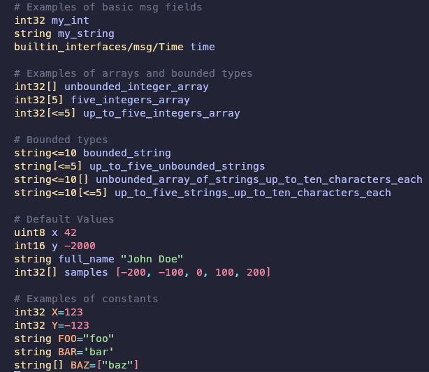
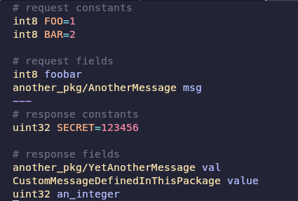
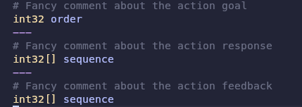
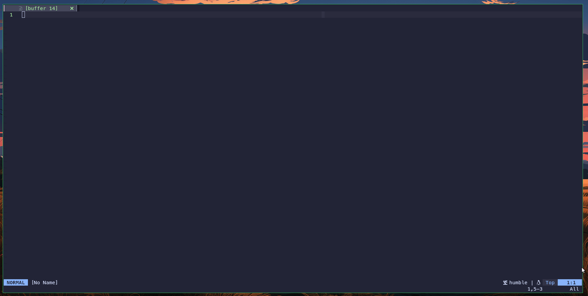
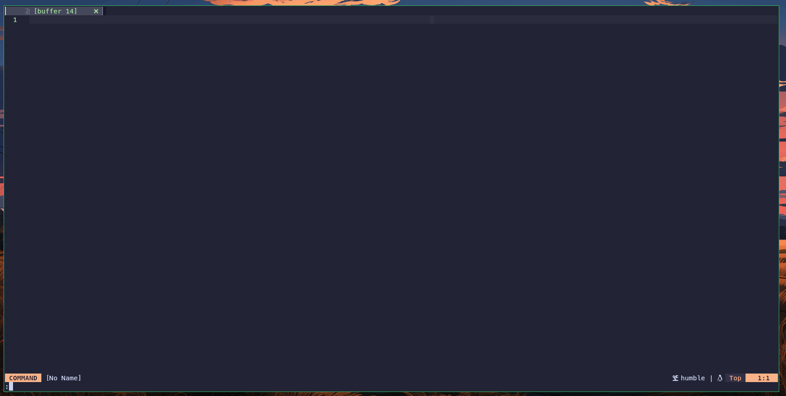
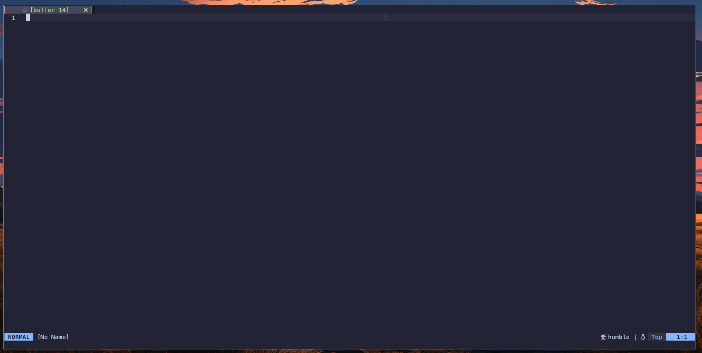
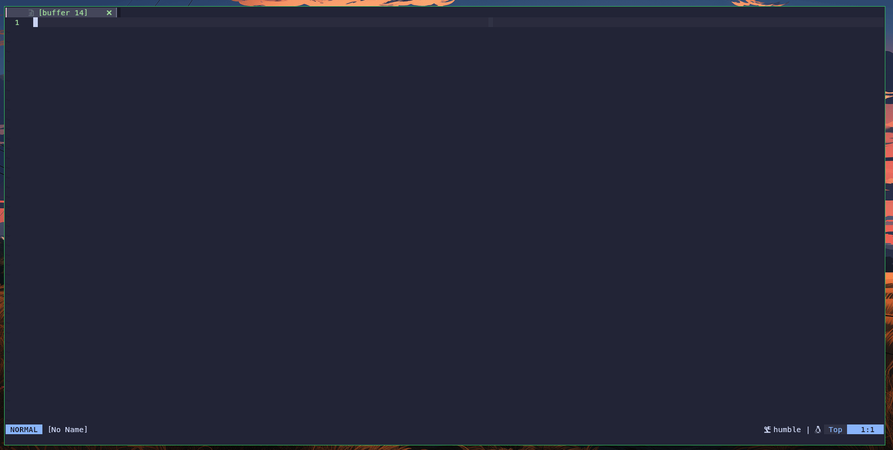

# 🎮 🐢 nvim-ros2

**nvim-ros2** is a simple lua plugin that adds useful features to enhance your development workflow
while developing ROS 2 modules.

## 🪄 Features

### 🌳 Treesitter Parser

- Custom grammar with syntax [highlights](./queries/ros2/highlights.scm) for [ROS 2 interfaces](https://docs.ros.org/en/humble/Concepts/Basic/About-Interfaces.html) following official conventions.
- After configuring the plugin, the grammar can be installed using `TSInstall ros2`

#### ✨ Highlights Examples

- `.msg` file



- `.srv` file



- `.action` file



### 🔭 Telescope

- [Telescope](https://github.com/nvim-telescope/telescope.nvim) extension that adds pickers for ROS 2 components

#### Active Actions with info preview



#### Active interfaces with show preview



#### Active Nodes with info preview



#### Active Services with type preview


#### Active topics with info preview



### Autocommands

- Configure `*.action`, `*.msg`, and `*.srv` files as `ros` filetype
- Configure `*.launch`, `*.xacro`, and `*.urdf` files as `xml` filetype

## 🧰 Installation

## Configuration

### Lazy.nvim

#### Default (Telescope)

```lua
return {
  "ErickKramer/nvim-ros2",
  dependencies = {
    "nvim-lua/plenary.nvim",
    "nvim-telescope/telescope.nvim",
    "nvim-treesitter/nvim-treesitter",
  },
  opts = {
    -- picker = "telescope", -- Default
    autocmds = true,
    treesitter = true,
  },
  keys = {
    { "<leader>li", function() require("nvim-ros2").pickers.interfaces() end, desc = "[ROS 2]: List interfaces" },
    { "<leader>ln", function() require("nvim-ros2").pickers.nodes() end, desc = "[ROS 2]: List nodes" },
    { "<leader>la", function() require("nvim-ros2").pickers.actions() end, desc = "[ROS 2]: List actions" },
    { "<leader>lt", function() require("nvim-ros2").pickers.topics_info() end, desc = "[ROS 2]: List topics with info" },
    { "<leader>le", function() require("nvim-ros2").pickers.topics_echo() end, desc = "[ROS 2]: List topics with echo" },
    { "<leader>ls", function() require("nvim-ros2").pickers.services() end, desc = "[ROS 2]: List services" },
  },
}
```

#### Snacks.nvim

```lua
return {
  "ErickKramer/nvim-ros2",
  dependencies = {
    "folke/snacks.nvim",
    "nvim-treesitter/nvim-treesitter",
  },
  opts = {
    picker = "snacks",
    autocmds = true,
    treesitter = true,
  },
  keys = {
    { "<leader>li", function() require("nvim-ros2").pickers.interfaces() end, desc = "[ROS 2]: List interfaces" },
    { "<leader>ln", function() require("nvim-ros2").pickers.nodes() end, desc = "[ROS 2]: List nodes" },
    { "<leader>la", function() require("nvim-ros2").pickers.actions() end, desc = "[ROS 2]: List actions" },
    { "<leader>lt", function() require("nvim-ros2").pickers.topics_info() end, desc = "[ROS 2]: List topics with info" },
    { "<leader>le", function() require("nvim-ros2").pickers.topics_echo() end, desc = "[ROS 2]: List topics with echo" },
    { "<leader>ls", function() require("nvim-ros2").pickers.services() end, desc = "[ROS 2]: List services" },
  },
}
```

#### Fzf-lua

```lua
return {
  "ErickKramer/nvim-ros2",
  dependencies = {
    "ibhagwan/fzf-lua",
    "nvim-treesitter/nvim-treesitter",
  },
  opts = {
    picker = "fzf",
    autocmds = true,
    treesitter = true,
  },
  keys = {
    { "<leader>li", function() require("nvim-ros2").pickers.interfaces() end, desc = "[ROS 2]: List interfaces" },
    { "<leader>ln", function() require("nvim-ros2").pickers.nodes() end, desc = "[ROS 2]: List nodes" },
    { "<leader>la", function() require("nvim-ros2").pickers.actions() end, desc = "[ROS 2]: List actions" },
    { "<leader>lt", function() require("nvim-ros2").pickers.topics_info() end, desc = "[ROS 2]: List topics with info" },
    { "<leader>le", function() require("nvim-ros2").pickers.topics_echo() end, desc = "[ROS 2]: List topics with echo" },
    { "<leader>ls", function() require("nvim-ros2").pickers.services() end, desc = "[ROS 2]: List services" },
  },
}
```

## Related Projects

- [taDachs/ros-nvim](https://github.com/taDachs/ros-nvim)
- [thibthib18/ros-nvim](https://github.com/thibthib18/ros-nvim)

## Disclaimer

The functionalities here provided were validated using [ROS 2 humble](https://docs.ros.org/en/humble/index.html).


